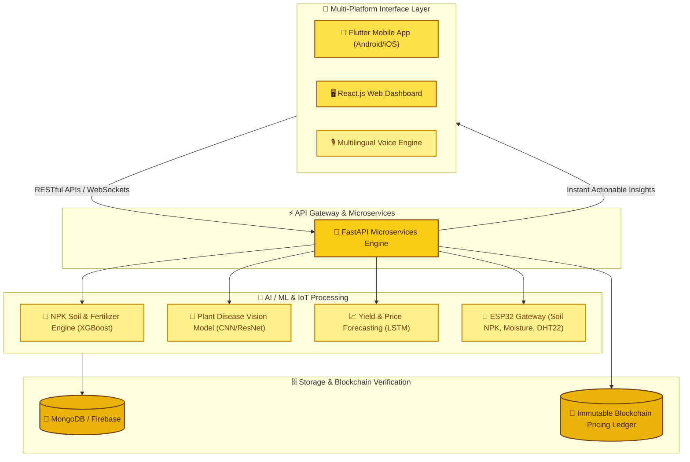

<div align="center">

<!-- Hero Header with Warm Butter Yellow / Honey Gold Gradient -->


<br/>

### 🌾 *Empowering Farmers Through Intelligent Data-Driven Agriculture.*

[](https://github.com/)
[](https://vit.ac.in)
[](LICENSE)

<br/>

<!-- Tech Stack Badges in Butter Yellow & Golden Amber Palette -->
[](https://react.dev/)
[](https://flutter.dev/)
[](https://fastapi.tiangolo.com/)
[](https://www.python.org/)
[](https://tensorflow.org/)
[](https://mongodb.com/)
[](https://firebase.google.com/)
[]()

<br/>

<p align="center">
  <a href="#-about-the-project">🌱 About</a> •
  <a href="#-core-team">👥 Team</a> •
  <a href="#-system-architecture">🏗️ Architecture</a> •
  <a href="#-key-features">✨ Features</a> •
  <a href="#-tech-stack">🛠️ Tech Stack</a> •
  <a href="#-installation--setup">🚀 Quickstart</a> •
  <a href="#-impact--benefits">📊 Impact</a>
</p>

---

</div>

<br/>

## 👥 Core Team & Lead Developers

<table align="center" width="100%">
  <tr>
    <td align="center" width="50%" style="background: #FFFDE7; border: 2px solid #FDE047; border-radius: 12px; padding: 16px;">
      <br/><br/>
      <b style="font-size: 18px; color: #713F12;">Darshana Mandal</b><br/>
      <span style="color: #854D0E;">Lead Developer & AI/ML Engineer</span><br/><br/>
      <a href="https://github.com/DarshanaMandal"></a>
    </td>
    <td align="center" width="50%" style="background: #FFFDE7; border: 2px solid #FDE047; border-radius: 12px; padding: 16px;">
      <br/><br/>
      <b style="font-size: 18px; color: #713F12;">Shreyash Gautam</b><br/>
      <span style="color: #854D0E;">Lead Architect & Full-Stack / IoT Engineer</span><br/><br/>
      <a href="https://github.com/shreyashgautam"></a>
    </td>
  </tr>
</table>

> 🌾 **"KrishiAI 360 was engineered to bridge the gap between traditional Indian farming and modern data science — combining ground IoT telemetry, neural crop diagnostics, and fair decentralized pricing."**

---

## 🏆 Recognition & Hackathon Details

<div align="center">

| 🏅 Parameter | 📋 Information |
|---|---|
| **Event** | **VITISH 2025 (National Level Hackathon)** |
| **Problem ID** | `25030` |
| **Theme** | **Agriculture, FoodTech & Rural Development** |
| **Institution** | Vellore Institute of Technology (VIT Chennai) |

</div>

---

## 🌱 About the Project

**KrishiAI 360** *(also known as **Krishi Deep** — "Light of Agriculture")* is an end-to-end **Smart Precision Agriculture & Farmer Empowerment Platform**.

Traditional farming often relies on guesswork, uncalibrated fertilizer application, and vulnerable supply chains. **KrishiAI 360** transforms every acre into an intelligent, data-driven ecosystem:

```
 📡 1. Sense (IoT)     → Real-time soil telemetry (Moisture, Temp, Humidity, N-P-K)
 🧠 2. Analyze (AI/ML) → Multi-model ensemble (XGBoost, LSTM, Random Forest)
 🎯 3. Recommend       → Crop suitability, NPK fertilizer balancing & disease detection
 🔐 4. Secure          → Blockchain-backed price transparency & direct marketplace
 📱 5. Deliver         → Accessible via Flutter Mobile App (Multilingual) & React Web
```

---

## 🚨 Problem Statement vs. The KrishiAI Solution

<div align="center">

| ❌ Challenges Faced by Modern Farmers | 🌾 KrishiAI 360 Solution |
|---|---|
| ⏳ **Unpredictable crop selection** based on intuition | 🧠 **AI-powered crop recommendation** based on exact soil NPK & climate data |
| 🧪 **Soil degradation** caused by over/under-fertilization | 📊 **Precision NPK Balancing Engine** with custom fertilizer dosage guidelines |
| 🦠 **Late crop disease identification** destroying yields | 🌿 **Computer Vision Plant Health Diagnosis** via leaf photo upload |
| 💸 **Middleman exploitation** & volatile wholesale pricing | 🔗 **Decentralized Blockchain Ledger** ensuring transparent MSP & trade logs |
| 🌐 **Low rural connectivity** preventing access to technology | 📱 **Offline-first Flutter app** with local language & voice interaction |

</div>

---

## 🏗️ System Architecture & Data Flow



---

## ✨ Key Features & Capabilities

### 🧪 1. Precision NPK Soil Intelligence (`backend_krisideep_npk`)
- Evaluates Nitrogen (N), Phosphorus (P), Potassium (K), soil pH, and temperature.
- Computes exact nutrient deficits and prescribes tailored organic and mineral fertilizer ratios.

### 🌿 2. Deep Learning Plant Pathology (`backend_krisi_ml_crophealth`)
- Upload plant leaf photographs to detect early fungal, bacterial, and pest infestations.
- Delivers curative treatment steps and preventative spray timelines.

### 📡 3. Live IoT Environmental Telemetry (`iot_arduino_code`)
- Continuous soil moisture, ambient humidity, temperature, and sun exposure logging via ESP32 microcontrollers.
- Automated irrigation pump control triggers based on dry soil thresholds.

### 🔗 4. Blockchain Fair-Trade Marketplace
- Cryptographically verified market rate tracking to prevent price manipulation.
- Direct farmer-to-consumer trading records with zero intermediary commissions.

### 📱 5. Multilingual Mobile & Web Experience (`krishideep_app` & `krisideepweb`)
- Intuitive voice queries and localized vernacular translations (Hindi, English, etc.).
- Offline telemetry sync with low-bandwidth caching for remote villages.

---

## 🛠️ Full-Stack Technology Suite

<div align="center">

| Component | Technologies | Purpose |
|---|---|---|
| **Mobile Client** | `Flutter` · `Dart` | Cross-platform mobile app for field monitoring |
| **Web Dashboard** | `React.js` · `TypeScript` · `Tailwind` | Analytics & agricultural management portal |
| **Microservices Backend** | `Python 3.9+` · `FastAPI` · `Uvicorn` | High-concurrency RESTful API endpoints |
| **AI / ML Frameworks** | `TensorFlow` · `Scikit-Learn` · `XGBoost` | Disease vision classification & crop recommendations |
| **IoT Hardware** | `ESP32` · `DHT22` · `Soil Moisture Sensor` · `Arduino` | Real-time edge soil & environmental telemetry |
| **Database & Cloud** | `MongoDB` · `Firebase Auth & Firestore` | Scalable patient crop logs and user profiles |
| **Security & Trust** | `SHA-256 Blockchain Ledger` · `Docker` | Tamper-proof price discovery and trade logs |

</div>

---

## 📁 Repository Structure

```
KrishiAI-360/
│
├── 📱 krishideep_app/                 # Flutter mobile client (iOS / Android)
├── 🖥️ krisideepweb/                   # React.js farmer web dashboard
├── 📥 krisideepweb_app_download/      # Web portal download & distribution center
│
├── 🧠 backend_krisi/                  # Core FastAPI gateway and auth service
├── 🌿 backend_krisi_ml_crophealth/    # Deep learning crop disease vision API
├── 🧪 backend_krisideep_npk/          # NPK soil chemistry & crop recommendation API
│
├── 📡 iot_arduino_code/               # ESP32 / Arduino firmware for soil sensors
├── 📄 VITISH'25_IdeaTemplate.pdf       # Hackathon concept & research documentation
└── 📖 README.md                       # Master project documentation
```

---

## 🚀 Quick Start & Installation Guide

### 📋 Prerequisites
- **Python 3.9+** & `pip`
- **Node.js 16+** & `npm`
- **Flutter SDK** (v3.0+)
- **Arduino IDE** (for flashing ESP32 hardware)

---

### 1️⃣ Clone the Repository

```bash
git clone https://github.com/shreyashgautam/KrishiAI-360.git
cd KrishiAI-360
```

---

### 2️⃣ Run the AI & Soil Backend Microservices

```bash
# Setup Core Backend
cd backend_krisi
python -m venv venv
source venv/bin/activate  # On Windows: venv\Scripts\activate
pip install -r requirements.txt
uvicorn main:app --reload --host 0.0.0.0 --port 8000
```

```bash
# In a new terminal: Setup NPK Recommendation Engine
cd backend_krisideep_npk
pip install -r requirements.txt
uvicorn main:app --reload --port 8001
```

```bash
# In a new terminal: Setup Crop Health Vision Engine
cd backend_krisi_ml_crophealth
pip install -r requirements.txt
uvicorn main:app --reload --port 8002
```

---

### 3️⃣ Launch the React Web Dashboard

```bash
cd krisideepweb
npm install
npm start
```
> 🌐 Web portal runs on `http://localhost:3000`

---

### 4️⃣ Launch the Flutter Mobile App

```bash
cd krishideep_app
flutter pub get
flutter run
```

---

### 5️⃣ Flash IoT Sensor Hardware (`iot_arduino_code`)

1. Open `iot_arduino_code/` in **Arduino IDE**.
2. Install **ESP32 Board Support Package** and `DHT sensor library`.
3. Configure your local Wi-Fi SSID and Backend API Endpoint in the configuration file.
4. Connect the ESP32 via USB and click **Upload**.

---

## 📊 Impact & Farmer Economics

<div align="center">

| Impact Vector | Projected Improvement | Real-World Value |
|---|---|---|
| 💰 **Farmer Net Income** | **+20% to +30%** | Higher market yield through calibrated planting and direct sale |
| 💧 **Irrigation Conservation** | **~30% Water Saved** | Trigger-based smart watering prevents over-saturation |
| 🧪 **Fertilizer Optimization** | **-25% Input Cost** | Eliminates excess chemical fertilizer spending |
| 🛡️ **Crop Loss Prevention** | **Up to 40% Risk Cut** | Early fungal & disease alerts protect harvests |

</div>

---

## 🔮 Future Roadmap

- [x] 📡 Real-time IoT sensor telemetry with ESP32
- [x] 🧪 Multi-factor NPK recommendation and fertilizer balancing
- [x] 🌿 Leaf disease detection vision model
- [x] 📱 Cross-platform Flutter mobile client & React web portal
- [ ] 🛰️ **Satellite Synthetic Aperture Radar (SAR)** integration for regional drought mapping
- [ ] 🚜 **Autonomous Drone Spraying Interface**: Route planning for automated precision pesticides
- [ ] 🗣️ **Conversational Voice AI Agent**: WhatsApp-based vernacular audio bot for instant farmer queries

---

## 📜 License & Acknowledgments

This project is licensed under the **MIT License**.

Special thanks to **VIT Chennai (VITISH 2025)**, **ICAR agricultural datasets**, and the agricultural community for providing invaluable field guidance.

---

<div align="center">

<br/>

### 🌾 **KrishiAI 360** — *Sowing Seeds of Smart, Sustainable Farming.*

**Developed by Darshana Mandal & Shreyash Gautam**

<br/>

[](https://github.com/shreyashgautam/KrishiAI-360)

<br/>


</div>
